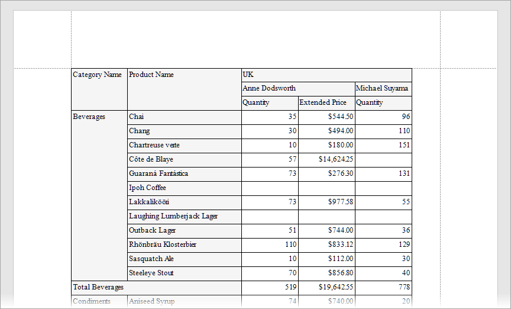

# Reporting for WinForms - Use XRCrossTab Control to Create Cross-Tab Report in Code

This example uses the [Cross Tab](https://docs.devexpress.com/XtraReports/DevExpress.XtraReports.UI.XRCrossTab) control to generate a [cross-tab report](https://docs.devexpress.com/XtraReports/4226/create-reports/create-a-cross-tab-report) in code.

## Files to Review

- [Form1.cs](CS/Form1.cs)(VB:[Form1.vb](VB/Form1.vb))

## Documentation

- [XRCrossTab Class](https://docs.devexpress.com/XtraReports/DevExpress.XtraReports.UI.XRCrossTab)
- [Create a Cross-Tab Report in Code](https://docs.devexpress.com/XtraReports/403673/detailed-guide-to-devexpress-reporting/reporting-api/create-reports-in-code/create-a-cross-tab-report)
- [Create a Cross-Tab Report](https://docs.devexpress.com/XtraReports/4226/create-reports/create-a-cross-tab-report)

## More Examples

- [Reporting - CrossTab Control Customization](https://github.com/DevExpress-Examples/reporting-crosstab-customization)
